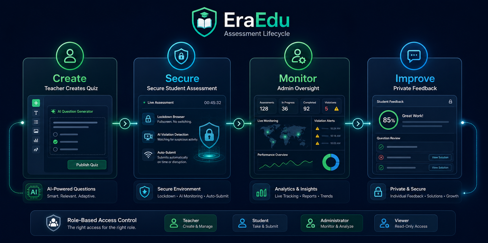

# EraEdu

> Our ICAT project by **Waqar** — built out of frustration, shipped as a real platform.

---

<p align="center">
  
</p>

## The problem that started it all

Durig COVID classes were moved online. So did the exams. Within a week, everyone knew the trick: open a second tab, mute the mic, look busy. Teachers could see us on Zoom but couldn't see what we were actually doing. The "honor system" was doing a lot of heavy lifting it wasn't built for.

I thought: *what if the platform itself was the invigilator?*

That question became EraEdu.

---

## What it does

EraEdu is a full-stack proctored learning and assessment platform where integrity is enforced at the system level, not by someone watching a grid of 30 faces.

- **Face-verified login** — password is step one. Webcam match is step two. If your face doesn't match your enrolled encoding, you don't get in. First-time login enrolls you automatically.
- **Live proctoring** — tab switches, focus loss, and face absence are logged as violations in real time during the quiz.
- **Teacher dashboard** — create courses, build quizzes, review submissions, and see a per-student violation report before you grade.
- **AI question generation** — stuck writing questions? Gemini drafts them. Students also get a study assistant.
- **4-digit access codes** — students join quizzes with a short code, no link-hunting required.

---

## How the login actually works

Most of the magic is in step 2:

1. Student sends email + password.
2. Backend validates and returns a **temporary** face-verification token — *not* a session token.
3. Frontend activates the webcam and captures a live frame.
4. `POST /api/auth/verify-face-login` runs a euclidean-distance match against the stored face encoding.
5. Only on a confirmed match is the real JWT issued.

Step 5 is the only door. There is no bypass route.

---

## Product experience

EraEdu brings quiz creation, secure student assessments, violation monitoring,
administrator oversight, analytics, and private student feedback into one
role-based platform.

<p align="center">
  
</p>

---

## Stack

| Layer | Tech |
|-------|------|
| Frontend | React 18 · TypeScript · Vite · Tailwind · Zustand · face-api.js |
| Backend | Node.js · Express · TypeScript · JWT · bcryptjs · helmet · express-rate-limit |
| Services | Supabase (Postgres) · Google Generative AI (Gemini) · Resend |

---

## Project layout

```
EraEdu/
├── frontend/   # React app — face-api.js models live in /public/models
├── backend/    # Express API, Supabase client, migrations
└── .github/    # CI workflows
```

---

## Run it locally

```bash
# backend
cd backend && npm install && npm run dev

# frontend (new terminal)
cd frontend && npm install && npm run dev
```

**Backend `.env`:**

```env
SUPABASE_URL=
SUPABASE_KEY=
SUPABASE_SERVICE_KEY=
JWT_SECRET=          # 32+ chars
GEMINI_API_KEY=
RESEND_API_KEY=
FRONTEND_URL=http://localhost:3000
PORT=5000
NODE_ENV=development
```

Run the face columns migration if you haven't:

```sql
-- backend/migrations/003_add_profile_picture_columns.sql
ALTER TABLE users ADD COLUMN IF NOT EXISTS profile_picture_url TEXT;
ALTER TABLE users ADD COLUMN IF NOT EXISTS face_encoding TEXT;
```

---

## Validate

```bash
# backend
cd backend && npx tsc --noEmit && npm test

# frontend
cd frontend && npm run lint && npm run build
```

---

## Deploy

- **Frontend** → GitHub Pages (Vite `BASE_URL` keeps model paths intact)
- **Backend** → Vercel serverless
- **Database** → Supabase

---

## Security

The backend was reviewed by a senior QA engineer — covering atomic submissions, race conditions, JWT lifetime, password hashing, helmet headers, and input validation. Full report in [`QA_REPORT.md`](./QA_REPORT.md).

---

## What I learned

This started as a project I had to submit. Somewhere around the third refactor it became the thing I actually wanted to build. Enforcing integrity at the platform level — not through surveillance, but through a clean, two-step authentication flow — turned out to be a genuinely interesting design problem.

The face-verification step especially. It sounds like overkill until you realize that without it, the whole system is just another honor policy with a nicer UI.

— **Waqar**
